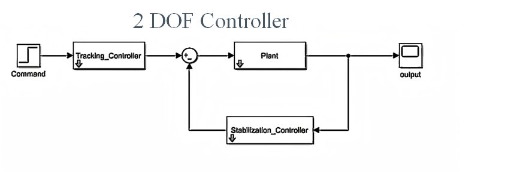
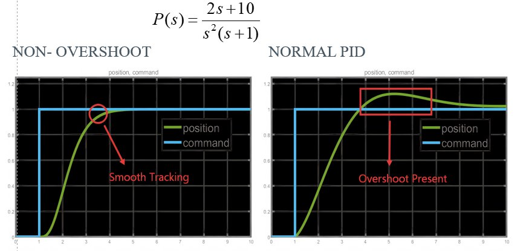

# 2-DOF Robust Control Synthesis Framework

### 1. Project Purpose and Relationship to the Dissertation
This repository contains the numerical implementation and experimental validation suite for the dissertation **"Overcoming Performance Limitations in PID Control via 2-DOF Synthesis"**. 
The core objective is to decouple the tracking performance from disturbance rejection. By utilizing the developed synthesis functions, the system guarantees a **non-overshooting step response** for a wide range of Linear Time-Invariant (LTI) plants, a feat often constrained by the "waterbed effect" in classical PID control.

### 2. Software Requirements and Setup
* **Environment**: MATLAB R2023a or later.
* **Toolboxes Required**: Control System Toolbox, Signal Processing Toolbox.
* **Hardware Integration**: Quanser Interactive Labs (for digital twin simulation) and Quanser Aero 2 hardware drivers (for physical validation).
* **Setup**: 
    1. Clone the repository.
    2. Run `addpath(genpath('./Function'))` in MATLAB to include the core synthesis engine.

### 3. Execution Workflow
The framework follows a modular "Feedback-then-Feedforward" design flow:
1.  **System Identification**: Define your plant transfer function $P(s)$.
2.  **Feedback Tuning**: Use `TwoDOFFeedbackTuningFunction` to optimize the stabilization and robustness (shaping the Sensitivity Function $S$).
3.  **Feedforward Synthesis**: Use `TwoDOFtuningFunction` to calculate the pre-filter that cancels zeros and shapes the reference tracking to be non-overshooting.
4.  **Verification**: Execute scripts in the `./Examples` folder to generate comparison plots between PID and the 2-DOF architecture.

### 4. Directory Structure
```text
├── Function/              # Core 2-DOF synthesis algorithms
│   ├── TwoDOFtuningFunction.m         # Feedforward (tracking) design
│   └── TwoDOFFeedbackTuningFunction.m # Feedback (stabilization) design
├── Examples/              # Numerical scripts for paper figures
├── media/                 # Multimedia assets
│   ├── layout.jpg         # Control topology diagram
│   ├── non-overshoot.jpg  # Comparative performance plot
│   └── quanser_video.mp4  # Hardware/Digital Twin demonstration
├── Main_Simulation.m      # Entry point for general MATLAB simulation
└── README.md              # Project documentation
```

### 5. Control Topology
The architecture employs a standard 2-DOF configuration where the feedback $C(s)$ ensures stability and disturbance rejection, while the feedforward $F(s)$ is synthesized to ensure optimal reference tracking.



### 6. Minimum Working Example
```matlab
% Define the LTI Plant (e.g., Quanser Aero 2 model)
plant_num = [2, 10];
plant_denum = [1, 1, 0, 0];
plant = tf(plant_num, plant_denum);

% 1. Stabilize and tune for robustness
stabilization_controller = TwoDOFFeedbackTuningFunction(plant);

% 2. Shape for non-overshooting tracking
tracking_controller = TwoDOFtuningFunction(plant_num, plant_denum, stabilization_controller);
```

### 7. Performance & Demonstration
#### **Experimental Output**
The synthesis ensures that the step response strictly follows the reference without overshoot, effectively overcoming the fundamental limitations of LTI feedback loops.



#### **Demo Video (Quanser Interactive Lab)**
A demonstration of the controller in a high-fidelity digital twin environment can be viewed via the link below:
* **[Watch Online Demo Video](https://streamable.com/c45owk)**
* **Local File**: A copy is available under the `./media/quanser_video.mp4` folder.

### 8. Attribution of Third-Party Components
* **Quanser Interactive Lab**: Digital twin environment provided by Quanser Inc.
* **Reference Algorithms**: The spectral factorization logic for robust tuning is based on the optimal control frameworks discussed in the dissertation bibliography.
* **Original Code**: All synthesis functions in the `./Function` directory and the automated tuning scripts were developed by the author for this Final Year Project.
```
